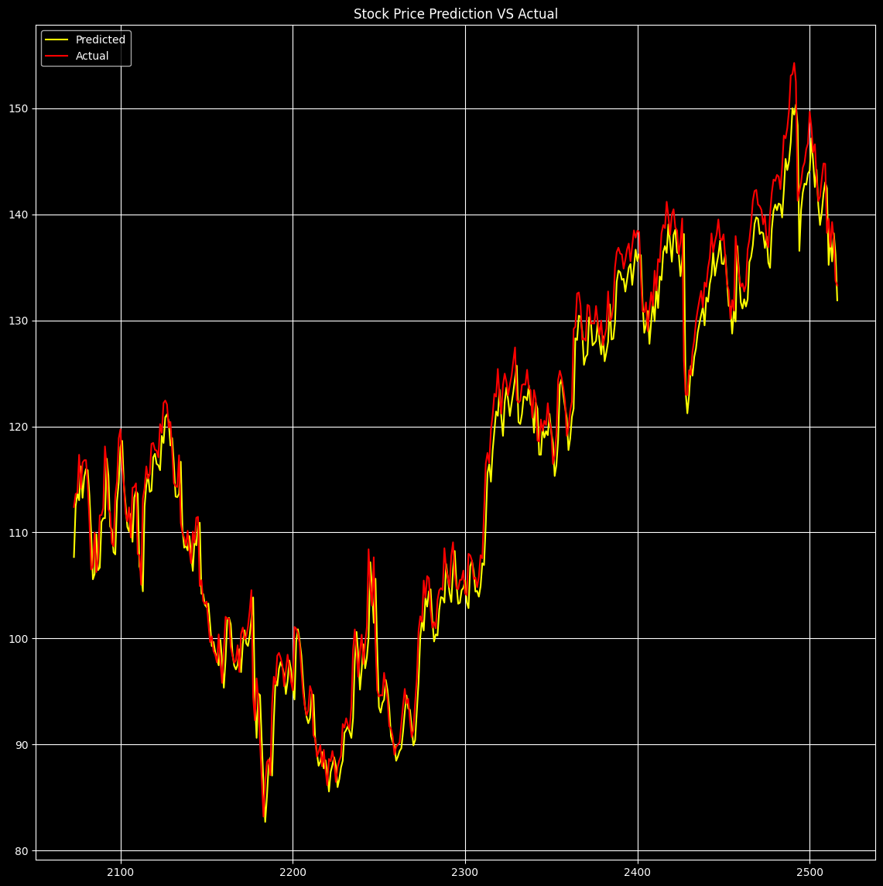
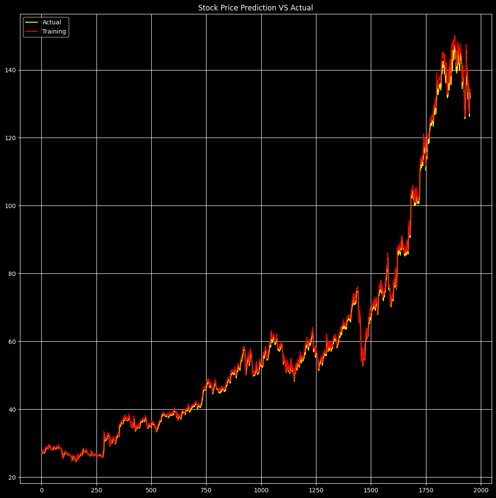

# Deep Learning Project
# Stock Price Prediction using (LSTM) Recurrent Neural Network - Long Short Term Memory

### Stock Price Prediction:
Stock, also referred to as equity, is a type of security that signifies ownership in a corporation. This ownership grants the stockholder a share of the company's assets and profits in proportion to the amount of stock they own. The individual units of stock are called "shares." In general, the term "stock" is used to describe the ownership certificates of any company. Stock prices fluctuate daily due to market forces, driven by the balance of supply and demand. When there is greater demand for a stock (more people want to buy than sell), its price increases. On the other hand, if there is more supply (more people want to sell than buy), the price decreases. Understanding the dynamics of supply and demand is relatively straightforward. However, the reason stock prices change is not entirely clear. Some people believe it's impossible to predict price movements, while others argue that by analyzing charts and past price trends, it's possible to predict the best times to buy and sell. One thing is certain: stock prices are highly volatile and can change rapidly.

### Understanding the Problem Statement
Before diving into the implementation of this project, it's essential to understand the problem we are addressing. Stock market analysis can be broadly divided into two categories: Fundamental Analysis and Technical Analysis. Fundamental Analysis involves evaluating a company's potential for future profitability by examining its current financial performance and business environment. In contrast, Technical Analysis focuses on analyzing charts and using statistical data to identify trends in the stock market. Our primary focus in this project will be on the technical analysis and visualization aspect. We will be working with a dataset of Google stock prices for both training and testing.

# Technologies Used
- Python
- TensorFlow / Keras
- NumPy & Pandas
- Matplotlib & Seaborn
- Scikit-Learn

# Performance of my Model

  
  

📜 License  
- This project is open-source under the MIT License.
